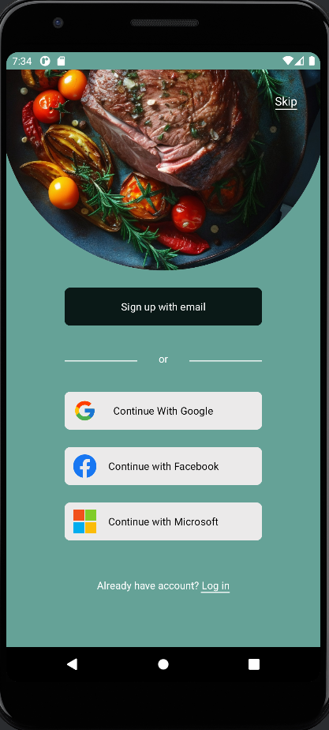

# PlatePal - Meal Planner App

PlatePal is an Android app developed for meal planning and recipe management. It allows users to organize their meals, create shopping lists, and discover new recipes.

## Features

- Meal planning
- Recipe management
- Shopping list creation
- User authentication with Firebase
- Real-time database integration with Firebase
- Network requests handled with Retrofit
- Image loading and caching with Glide
- Asynchronous programming with RxJava

## Installation

To install PlatePal on your Android device, follow these steps:

1. Clone the repository: `git clone https://github.com/HadirElnagdy/Android_Java_MealPlanner.git`
2. Open the project in Android Studio
3. Build and run the project on your device or emulator

## Dependencies

The following libraries and frameworks were used in the development of PlatePal:

- AndroidX Libraries
- Firebase
- Retrofit
- Glide
- RxJava

## Screenshots

## Contributing

Contributions to PlatePal are welcome! Feel free to submit bug reports, feature requests, or pull requests.
